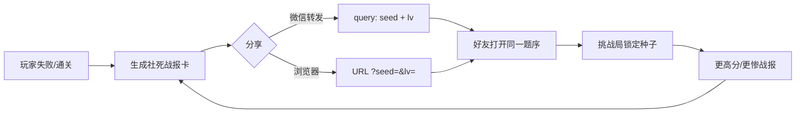

# 《摸鱼判官》设计说明书

## 1. 架构（低延迟）

```
┌─────────────────────────────────────────────┐
│  Client Authority（玩法权威在端上）            │
│  - 种子建关 / 判定 / 连击 / 结算 全部本地完成   │
│  - 触摸到反馈目标 ≤ 1 帧（RAF + Canvas）      │
│  - 对局中零网络请求                           │
└─────────────────────────────────────────────┘
                 │ 仅分享 / 可选广告 / 可选榜
                 ▼
┌─────────────────────────────────────────────┐
│  Platform Bridge                             │
│  Web: URL query + Clipboard/Web Share        │
│  微信: onShareAppMessage query=seed&lv       │
│  广告: 激励视频（前 3 局关闭）                 │
└─────────────────────────────────────────────┘
```

**为什么不把判定放服务端？**  
判定是 1.5s 决策窗的手速游戏，任何 RTT 都会毁掉「羊了个羊式」爽感。公平性靠「同种子同题序」保证好友对比，而不是权威服。

## 2. 第 3 关难度参数（主卡点）

| 参数 | L1 | L2 | L3（周五 17:59） |
|------|----|----|------------------|
| 目标通过率 | ~85% | ~35% | **1%–5%** |
| 人数 | 8 | 12 | 20 |
| 决策窗 | 3200ms | 2400ms | **1500ms** |
| 血量 | 3 | 3 | **2** |
| 伪装强度 | 0.15 | 0.45 | **0.82** |
| 信号冲突率 | 0 | 0.15 | **0.55** |
| 连击 Frenzy | - | - | 连击≥6 后节奏 ×0.72 |

调参文件：
- Web: `src/game/data/levels.js`
- 微信: `minigame/js/data.js`

**调参口诀**：先动 `decisionWindowMs` 与 `conflictChance`；不要先加人数（人数只增加时长，不增加「差一口气」感）。

## 3. 战报文案库

失败优先于成功传播。模板见 `src/game/data/copy.js`：

- `我在周五场只撑了 {seconds} 秒，你来？`
- `识破 {correct}/{total}，连击 {combo}，求超越`
- `栽在：{failOn}，不服来审`
- `还差 {remain} 个装忙，群里谁顶得住？`

特殊规则：
- 误判老板 → 固定社死句
- remain ≤ 3 → 「就差一口气」句（最强求战）

## 4. 分享回流路径



关键字段：
- `seed`：base36 无复现随机种子
- `lv`：1/2/3

群聊钩子：同一 `seed+lv` = 同一同事顺序，成绩可横向攀比。

## 5. 变现点（不挡传播）

1. 前 3 局 `adFreeRuns`：只失败、只分享  
2. 广告卖戏剧性：复活再审 5 人 / 开天眼 10 秒  
3. 付费卖身份（后续）：判官皮肤、结算动效、群称号  
4. **不卖通关、不卖减难**（避免毒化胜负欲）
