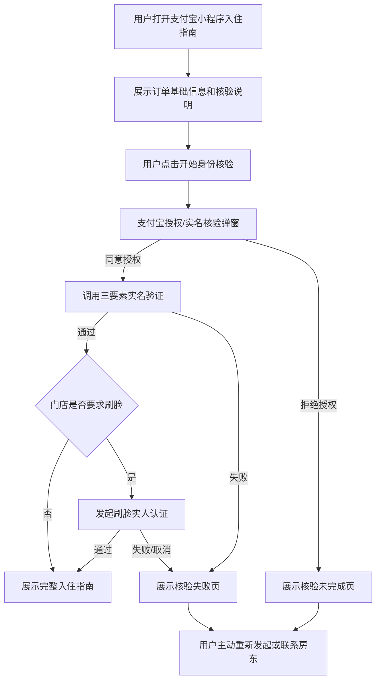

# 支付宝小程序实名/实人认证能力申请 DEMO 说明

## 1. 申请背景

久窝 C 端支付宝小程序用于民宿/酒店旅客自助办理入住。旅客在入住前需要完成身份信息采集与核验，房东/门店再根据核验结果办理入住、生成门锁/客控相关授权，并按监管要求留存入住人身份信息。

本次申请支付宝小程序身份核验能力，主要用于以下场景：

- 旅客在支付宝小程序中打开入住指南；
- 旅客提交本人姓名、身份证号、手机号等入住实名信息；
- 系统通过支付宝实名三要素或刷脸实人认证能力，确认「提交身份信息的人」与支付宝实名账户/本人一致；
- 核验通过后，旅客可继续查看完整入住指南、门锁密码/蓝牙钥匙等入住信息；
- 核验失败或用户拒绝授权时，系统不展示敏感入住信息，并提示用户可重新发起核验或联系房东线下处理。

## 2. 申请能力范围

本说明覆盖两类申请口径：

### 2.1 方案二：用户实名三要素验证

用于验证用户在小程序填写的：

- 姓名
- 身份证号
- 手机号

与支付宝实名体系中的信息是否一致。

适用场景：

- 旅客首次打开入住指南；
- 旅客提交入住实名信息；
- 系统在展示门锁密码、入住地址细节等敏感信息前进行核验。

需要向支付宝提供：

- 小程序实名三要素调用 DEMO；
- 使用背景说明；
- 授权前/授权弹窗/同意后/拒绝后的页面说明。

### 2.2 方案三：用户刷脸实人认证后验证

用于进一步确认用户本人操作，适合更高安全等级的入住核验场景。

适用场景：

- 门店要求严格实人入住；
- 未成年人/重点风控订单；
- 房东开启「入住前实人认证」；
- 需要确保身份证信息与现场操作人一致。

需要向支付宝提供：

- 已通过实名三要素能力申请；
- 刷脸实人认证后的业务 DEMO；
- 相关机构管理要求文件，例如：
  - 营业执照/主体资质；
  - 民宿/酒店住宿业务说明；
  - 用户授权与隐私政策说明；
  - 身份信息使用、存储、脱敏与删除机制说明；
  - 监管/公安入住登记相关要求说明。

## 3. DEMO 页面流程

支付宝要求说明以下 4 个页面/状态：

1. 用户授权前的上级场景；
2. 授权弹窗页面，包括授权文案详情；
3. 用户同意授权后的下级场景；
4. 用户拒绝授权后的下级场景。

久窝小程序 DEMO 建议如下。

---

## 4. 用户授权前的上级场景

### 4.1 页面名称

入住指南 - 身份核验页

### 4.2 触发入口

旅客通过以下任一入口进入支付宝小程序：

- 房东发送的入住指南短信链接；
- 支付宝小程序订单入口；
- 入住前提醒消息中的「查看入住指南」按钮。

进入后，系统先展示基础订单信息：

- 民宿/门店名称；
- 房间名称；
- 入住日期、退房日期；
- 入住人姓名；
- 核验状态。

在用户完成核验前，不展示以下敏感信息：

- 详细门牌号/隐私导航说明；
- 门锁密码；
- 蓝牙钥匙；
- 客控授权信息；
- 房东私密联系方式。

### 4.3 页面文案示例

标题：

> 入住前需完成身份核验

说明：

> 根据住宿实名登记要求，您需要完成本人身份核验后，才可查看完整入住指南、门锁密码和自助入住信息。核验信息仅用于本次住宿登记与安全验证。

按钮：

> 开始身份核验

点击按钮后，进入支付宝授权弹窗/实名核验流程。

---

## 5. 授权弹窗页面

### 5.1 弹窗触发动作

用户点击「开始身份核验」后触发支付宝授权能力。

### 5.2 授权信息范围

方案二需要申请/核验：

- 用户姓名；
- 用户身份证号；
- 用户手机号；
- 支付宝实名核验结果。

方案三需要申请/核验：

- 用户实名信息；
- 用户刷脸实人认证结果；
- 认证流水号/核验结果状态。

### 5.3 授权弹窗文案建议

授权标题：

> 授权久窝获取实名核验结果

授权说明：

> 久窝将使用您的支付宝实名信息进行住宿入住身份核验，用于确认入住人与实名账户一致。核验通过后，您可查看完整入住指南、门锁密码及自助入住信息。久窝不会将您的实名信息用于本次住宿服务以外的其他用途。

授权项展示：

- 姓名；
- 身份证号；
- 手机号；
- 实名/实人认证结果。

按钮：

- 同意授权；
- 拒绝。

---

## 6. 用户同意授权后的下级场景

### 6.1 三要素核验通过

用户同意授权并通过三要素核验后，系统进入「核验成功」页。

页面展示：

- 核验结果：已通过；
- 入住人姓名；
- 入住日期；
- 房间名称；
- 「查看完整入住指南」按钮。

文案示例：

> 身份核验已通过。您现在可以查看完整入住指南，包括地址导航、Wi-Fi、门锁密码和入住注意事项。

系统动作：

- 记录核验通过状态；
- 关联当前订单/入住指南链接；
- 向 PMS 同步核验结果；
- 允许展示完整入住指南；
- 到达门锁密码可见时间后展示门锁密码。

### 6.2 刷脸实人认证通过

如果门店要求刷脸实人认证，三要素通过后继续进入刷脸认证流程。

刷脸通过后页面展示：

> 实人认证已通过，您可以继续办理自助入住。

系统动作：

- 记录实人认证通过状态；
- 保存认证流水号/核验状态；
- 不在前端页面展示完整身份证号；
- 后台日志和审计记录做脱敏处理。

---

## 7. 用户拒绝授权后的下级场景

用户点击「拒绝」或中断认证后，系统进入「核验未完成」状态。

页面展示：

标题：

> 身份核验未完成

说明：

> 为保障住宿安全并满足实名登记要求，完成身份核验后才可查看完整入住指南和门锁密码。您可以重新发起核验，或联系房东/客服线下处理。

按钮：

- 重新发起核验；
- 联系房东；
- 返回订单。

系统限制：

- 不展示门锁密码；
- 不展示蓝牙钥匙；
- 不展示完整私密入住信息；
- 不把订单标记为已核验；
- 不强制用户反复弹出授权弹窗。

### 7.1 防止强制授权说明

用户拒绝授权后，系统不会立即、连续、强制重复弹出授权窗口。

处理方式：

- 页面展示拒绝后的解释和替代操作；
- 只有用户再次主动点击「重新发起核验」时，才重新调用授权流程；
- 提供「联系房东/客服线下核验」作为替代路径。

---

## 8. DEMO 交互链路汇总

## 9. 数据使用与安全说明

### 9.1 使用目的

实名/实人认证结果仅用于：

- 住宿实名登记；
- 入住人身份核验；
- 展示门锁密码/自助入住信息前的安全校验；
- 房东/门店办理入住；
- 必要的审计与监管留痕。

### 9.2 数据最小化

系统只采集完成入住核验所需字段：

- 姓名；
- 身份证号；
- 手机号；
- 核验结果；
- 认证流水号；
- 认证时间。

### 9.3 隐私与脱敏

- 前端不展示完整身份证号；
- 后台日志不打印完整身份证号；
- 审计记录对证件号、手机号做脱敏；
- 身份证照片、人脸照片使用私有存储；
- 仅授权房东/门店相关账号可查看必要信息。

### 9.4 用户权益

- 授权前明确说明使用目的；
- 用户可拒绝授权；
- 拒绝后提供线下核验/联系房东替代路径；
- 不重复强制弹窗；
- 不将实名信息用于住宿服务以外的营销或无关用途。

## 10. 方案二 DEMO 说明模板

提交给支付宝时可使用以下简版说明：

> 久窝支付宝小程序用于民宿/酒店旅客自助入住。旅客在查看入住指南、门锁密码和自助入住信息前，需要完成住宿实名登记。小程序将在旅客主动点击「开始身份核验」后，调用支付宝实名三要素验证能力，对旅客提交的姓名、身份证号、手机号进行一致性核验。核验通过后展示完整入住指南；核验失败或用户拒绝授权时，不展示门锁密码等敏感信息，并提供重新核验或联系房东线下处理入口。本能力仅用于住宿实名登记和入住安全核验。

## 11. 方案三 DEMO 说明模板

提交给支付宝时可使用以下简版说明：

> 久窝支付宝小程序在住宿实名登记场景下，需要进一步确认入住人为本人操作。对于开启实人认证的门店，旅客完成实名三要素验证后，将继续调用支付宝刷脸实人认证能力。认证通过后，系统记录认证结果并允许旅客查看完整入住指南和自助入住信息；认证失败、取消或拒绝时，不展示门锁密码、蓝牙钥匙等敏感信息。相关身份信息仅用于住宿实名登记、门店安全管理和必要审计，不用于其他营销用途。

## 12. 可交付给支付宝的 DEMO 页面清单

建议准备 4 张截图或录屏：

1. **授权前页面**：入住指南页提示「入住前需完成身份核验」；
2. **授权弹窗页面**：展示申请实名核验权限、授权文案和同意/拒绝按钮；
3. **同意授权后页面**：展示「核验成功」并进入完整入住指南；
4. **拒绝授权后页面**：展示「核验未完成」，提供重新核验和联系房东入口。

如申请方案三，再补充：

5. **刷脸认证前说明页**；
6. **刷脸认证成功后的入住指南页**；
7. **刷脸失败/取消后的兜底页**。
