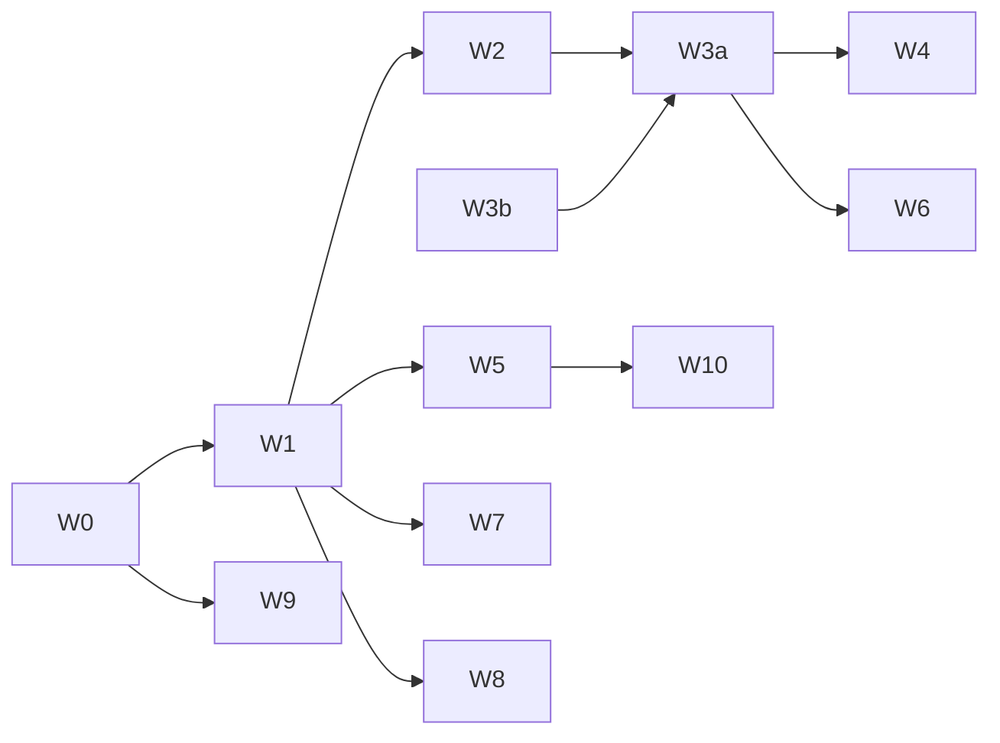

# 02 · 工作量与 WBS

> **关于工作量口径**：本文用**相对规模（T-shirt 尺码）+ 故事点（Fibonacci）+ 客观规模计数**（表数 / 接口数 / 页面数）来衡量工作量，**不给日历工期（人日/周）**。原因：真实排期取决于团队人数、并行度、复用与联调节奏，应由团队用自身速度（velocity）把故事点换算成排期。文末给出换算指引。
> 尺码参照：`S≈1-2点`，`M≈3-5点`，`L≈8点`，`XL≈13点`，`XXL≈21点`（含设计+前后端+联调+自测）。

---

## 1. 工作分解结构（WBS）

```
mbs-web-mp 全新 C 端
├─ W0 基础设施与地基（MBS 自有域落地）
│   ├─ MBS 独立数据库与领域分层（NestJS 模块化：交易/营销/内容/消息/用户）
│   ├─ 幂等键 / outbox / 事件总线 / 定时任务基座
│   ├─ 敏感字段加密与脱敏、审计
│   └─ 网关/签名沿用，MBS→PMS SDK 客户端（hold/confirm/release 幂等封装）
├─ W1 账号与登录（E1）
├─ W2 发现与详情（E2/E3，含只读检索快照同步）
├─ W3 交易闭环（E4/E5）★最重
│   ├─ MBS：交易订单/支付/退款/发票
│   └─ PMS：hold/confirm/release/quote/availability 接口（跨团队）
├─ W4 入住服务复用改造（E6）
├─ W5 会员与营销（E7）
├─ W6 评价（E8）
├─ W7 消息中心（E9）
├─ W8 个人中心（E10）
├─ W9 合规与安全（E11）
└─ W10 C 端运营后台（E12，mbs-admin 扩展）
```

---

## 2. 工作量评估表

> 列：MBS(后端) / PMS(后端，跨团队) / FE(小程序前端) / 联调测试。点数为该工作包合计故事点区间。

| 包 | 模块 | 尺码 | 故事点 | MBS 后端 | PMS 后端 | 小程序 FE | 关键风险 |
|---|---|:---:|:---:|:---:|:---:|:---:|---|
| W0 | 基础设施/地基 | L | 8–13 | ●●● | ○ | ○ | 领域分层、幂等/outbox 一次做对 |
| W1 | 账号与登录 | M | 5–8 | ●● | ○ | ●● | 多端 unionid 合一 |
| W2 | 发现与详情 | L | 8–13 | ●● | ●（quote/listing 开放） | ●●● | 检索快照一致性、地图 |
| W3a | 交易订单/支付/退款(MBS) | XL | 13–21 | ●●●● | — | ●●● | 支付回调幂等、退款状态机 |
| W3b | 占房接口 hold/confirm/release(PMS) | L | 8–13 | ○（对接） | ●●●●（新增） | — | **超卖/事务/最终一致** |
| W4 | 入住服务复用改造 | S–M | 3–5 | ●（改入口） | ○（复用） | ●● | 从交易单进入的跳转 |
| W5 | 会员与营销 | XL | 13–21 | ●●●● | — | ●●● | 券/积分并发核销、防刷 |
| W6 | 评价 | M | 5–8 | ●●● | ○（回复写回） | ●● | 图片/内容安全 |
| W7 | 消息中心 | M | 5–8 | ●●● | — | ●● | 订阅消息模板审核 |
| W8 | 个人中心 | M | 5–8 | ●●● | — | ●●● | 常用入住人加密 |
| W9 | 合规与安全 | M | 5–8 | ●●（加密/协议） | ●（核验复用） | ●● | 敏感数据合规 |
| W10 | C 端运营后台 | L | 8–13 | ●●●（含 admin FE） | — | — | 与营销/内容联动 |
| **合计** | | | **≈ 96–147 点** | | | | |

**规模总览（客观计数）**：

- MBS 自有库新增表：**约 30 张**（见 `05-表设计.md`）。
- 需 PMS **新增/整合的对 C 端接口**：**约 8–10 个**（hold/confirm/release/quote/listing 检索/详情等，见 `03` 第 5 节），其余履约接口复用现有。
- MBS 新增接口：**约 60–80 个**（各域 CRUD + 交易/支付/营销流程）。
- 小程序页面：**约 40–55 屏**（首页/搜索/详情/日历/下单/支付/订单列表·详情/入住指南/实名/评价/会员/券包/消息/个人中心等）。
- 支付渠道对接：微信支付 + 支付宝支付（含回调、退款、对账）各一套。

> 上述点数为"一次把体系搭起来"的规模。若一期收敛范围（见第 4 节 MVP），可先落 **≈ 55–70 点**。

---

## 3. 依赖与关键路径



- **关键路径**：`W0 → W1 → W2 → W3a`，且 **W3a 依赖 W3b（PMS 占房接口）**——W3b 是**跨团队强依赖**，必须**最先与 PMS 团队对齐并优先排入 PMS 迭代**，否则阻塞整个交易闭环。
- W4（入住服务）依赖 W3a 产出的 `pms_booking_id` 打通后才能"从交易单进入"。
- W5/W6/W7/W8 相互独立，可并行。

---

## 4. 分期路线（建议）

**一期 · 交易闭环 MVP（把"能在小程序里下单入住"跑通）**
- W0 基础设施、W1 账号（微信登录优先）、W2 发现与详情（基础搜索+详情+报价）、**W3a+W3b 交易闭环**、W4 入住服务复用、W9 合规基线。
- 目标：**发现 → 下单 → 支付 → 占房 → 入住指南/实名 → 自助退房 → 评价（基础）**。
- 规模：**≈ 55–70 点**。

**二期 · 增长与留存**
- W5 会员与营销（券/会员/积分/签到/邀请）、W6 评价完善、W7 消息中心（订阅消息）、W8 个人中心完善、W10 运营后台。
- 规模：**≈ 40–60 点**。

**三期 · 精细化（可选）**
- 推荐/榜单、积分商城、购物车/组合下单、地图找房增强、客服工单、支付宝端拉齐。

---

## 5. 故事点 → 排期换算指引（团队自算，不在此给日历值）

1. 用团队最近 2–3 个迭代的**实际速度**（每迭代完成点数）作为基准 `V`。
2. 并行度：交易域（MBS）、占房（PMS）、小程序 FE 三条线可并行，取**瓶颈线**估算，而非三线相加。
3. 缓冲：跨团队联调（W3b）、支付渠道审核/报备、订阅消息模板审核属外部依赖，需预留联调与审批缓冲。
4. 结论：`一期排期 ≈ 一期点数 ÷ 瓶颈线速度 + 外部审批缓冲`。请团队据 `V` 自行折算。

---

## 6. 人力建议（角色，非工期）

| 角色 | 主要承担 |
|---|---|
| MBS 后端 ×N | W0/W1/W3a/W5/W6/W7/W8/W10 交易与营销域 |
| PMS 后端 ×1（协作） | W3b 占房接口 + 对 C 端接口开放 + booking 状态回写 |
| 小程序前端 ×N | 全部 40–55 屏（微信优先，支付宝二期拉齐） |
| 测试/QA | 交易与支付资金链路、并发占房、退款、幂等重点覆盖 |
| 产品/运营 | 券/会员/活动规则、订阅消息文案、协议合规 |
