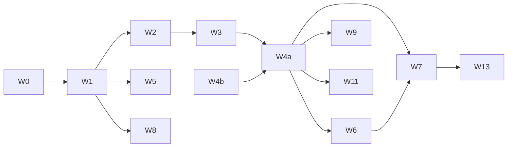

# 02 · 工作量与 WBS

> **工作量口径**：用**相对规模(T-shirt)+故事点(Fibonacci)+客观规模计数**（表数/接口数/页面数），**不给日历工期(人日/周)**——排期由团队按自身速度(velocity)自行折算（文末给指引）。
> 尺码：`S≈1-2`,`M≈3-5`,`L≈8`,`XL≈13`,`XXL≈21` 点（含设计+前后端+联调+自测）。

---

## 1. WBS

```
mbs-web-mp「久窝朋赞会」
├─ W0 基础设施地基（MBS 自有域）
│   ├─ MBS 独立库 + NestJS 领域分层（用户/交易/会员/营销/钱包/内容/AI/触达/横切）
│   ├─ 幂等键 + outbox + 事件消费（PMS 入住完成事件）+ 定时任务基座
│   ├─ 资金台账基座（钱包/积分/成长值：只增不改 + 对账）
│   ├─ 敏感字段加密/脱敏、审计
│   └─ MBS→PMS 客户端 SDK（hold/confirm/release/quote/lock-credential 幂等封装）
├─ W1 账号与登录（E1）
├─ W2 发现与搜索（E3：搜索/城市/结果/问栖AI球）
├─ W3 门店与房源（E4：store/room/安心住）
├─ W4 交易闭环（E5/E6）★最重
│   ├─ MBS：交易订单/支付/退款/发票/定价服务（会员折×券×随心住×储值）
│   └─ PMS：hold/confirm/release/quote 占房接口（跨团队）
├─ W5 平台会员 + 成长值（E7）
├─ W6 门店会员 + 门店晚数成长（E8，依赖 PMS 入住完成事件）
├─ W7 钱包与权益：随心住/储值/积分/券/礼品卡（E9）★资金重
├─ W8 AI 行程（E10：planner/result/trips/问栖/今日行程）
├─ W9 收藏足迹/客服/发票（E11）
├─ W10 安心住·住中服务（E12，复用开锁分支）
├─ W11 首页·住中（E2，聚合在住卡+今日行程+礼遇）
├─ W12 合规与安全（E13）
└─ W13 C 端运营后台（E14，mbs-admin 扩展）
```

---

## 2. 工作量评估表

> ● 表示该线投入强度。PMS 列为跨团队。

| 包 | 模块 | 尺码 | 故事点 | MBS 后端 | PMS 后端 | 小程序 FE | 关键风险 |
|---|---|:---:|:---:|:---:|:---:|:---:|---|
| W0 | 基础设施/资金台账基座 | L | 8–13 | ●●● | ○ | ○ | 幂等/outbox/资金台账一次做对 |
| W1 | 账号与登录 | M | 5–8 | ●● | ○ | ●● | 多端 unionid 合一 |
| W2 | 发现与搜索 + 问栖AI球 | L | 8–13 | ●● | ●(quote/listing) | ●●● | 语音识别、NL解析、检索 |
| W3 | 门店与房源 | M | 5–8 | ●● | ●(详情/房型) | ●●● | 安心住标、随心住卡联动 |
| W4a | 交易订单/支付/退款/发票/定价(MBS) | XL | 13–21 | ●●●● | — | ●●● | 支付幂等、退款、组合定价 |
| W4b | 占房 hold/confirm/release(PMS) | L | 8–13 | ○ | ●●●●(新增) | — | **超卖/事务/最终一致** |
| W5 | 平台会员 + 成长值台账 | M | 5–8 | ●●● | ○ | ●● | 成长值规则/年度结算 |
| W6 | 门店会员 + 晚数成长(事件驱动) | L | 8–13 | ●●● | ●(入住完成事件) | ●● | **成长事实以PMS为准**、幂等加分 |
| W7 | 随心住/储值/积分/券/礼品卡 | XL | 13–21 | ●●●● | ○(核销占房) | ●●● | **预付资金合规/核销事务/防超发** |
| W8 | AI 行程(planner/result/trips/问栖) | XL | 13–21 | ●●●● | — | ●●●● | LLM 成本/质量、POI 内容库 |
| W9 | 收藏足迹/客服/发票 | M | 5–8 | ●●● | — | ●● | |
| W10 | 安心住·开锁·住中服务 | M | 5–8 | ●●(封装) | ●(开锁凭证) | ●● | 复用现有开锁分支 |
| W11 | 首页·住中聚合 | S–M | 3–5 | ●● | ●(在住 booking) | ●● | 多态聚合 |
| W12 | 合规与安全 | M | 5–8 | ●● | ●(核验) | ●● | 敏感数据、预付资金合规 |
| W13 | C 端运营后台 | L | 8–13 | ●●●(含 admin FE) | — | — | 会员/券/随心住/内容配置 |
| **合计** | | | **≈ 117–171 点** | | | | |

**规模总览（客观计数）**：

- MBS 自有库新增表：**约 40 张**（会员/钱包/积分/成长/随心住/券/礼品卡/交易/AI行程/内容…见 `05`）。
- 需 PMS **新增/整合接口**：**约 9–11 个**（hold/confirm/release/quote/listing/detail/入住完成事件/开锁凭证/取消/指南复用）。
- MBS 新增接口：**约 80–110 个**（各域 CRUD + 交易/支付/会员/钱包/AI 流程）。
- 小程序页面：原型已 **17 页 + 2 组件**；补全登录/客服/发票/协议等后 **约 22–28 屏**。
- 支付渠道：微信支付 + 支付宝支付（下单/回调/退款/对账）；**预付资金**（随心住/储值）单独资金台账与对账。
- AI：LLM 行程生成 + POI 内容库 + 语音识别（问栖）。

> 若一期收敛范围（见第 4 节 MVP），可先落 **≈ 60–80 点**。

---

## 3. 依赖与关键路径



- **关键路径**：`W0→W1→W2→W3→W4a`，且 **W4a 依赖 W4b（PMS 占房接口）**——跨团队强依赖，须最先与 PMS 对齐并优先排入 PMS 迭代。
- **W6（门店会员成长）依赖 PMS "入住完成事件"**——第二个跨团队依赖，早对齐。
- **W7（随心住/储值预付资金）**牵涉财务/法务合规口径，早启动。
- W5/W8/W9 相对独立可并行。

---

## 4. 分期路线（建议）

**一期 · 会员直订 MVP（把"在小程序里成为会员并直订入住"跑通）**
- W0、W1（微信登录优先）、W2（基础搜索+问栖可后置）、W3、**W4a+W4b 交易闭环**、W5（平台会员+成长值）、W10（安心住开锁复用）、W11（住中卡）、W12 合规基线。
- 闭环：发现 → 房源 → 直订支付 → 占房 → 安心住入住 → 离店成长值 → 平台会员升级。
- 规模：**≈ 60–80 点**。

**二期 · 会员深化与预付**
- W6（门店会员+晚数成长）、**W7（随心住/储值/积分/券/礼品卡）**、W9（收藏/客服/发票）、W13（运营后台）。
- 规模：**≈ 45–65 点**。

**三期 · AI 与增长**
- W8（AI 行程助手/问栖/今日行程完整版）、签到/邀请裂变、榜单/推荐、支付宝端拉齐。

---

## 5. 故事点 → 排期换算指引（团队自算）

1. 用团队近 2–3 迭代**实际速度 V**为基准。
2. 三条线（MBS 交易/会员、PMS 占房+事件、小程序 FE）可并行，估**瓶颈线**而非相加。
3. 外部依赖需预留缓冲：跨团队占房/事件联调、支付渠道报备、**预付资金合规审查**、AI/语音接入、订阅消息模板审核。
4. `一期排期 ≈ 一期点数 ÷ 瓶颈线速度 + 外部审批缓冲`。

## 6. 人力建议（角色，非工期）

| 角色 | 承担 |
|---|---|
| MBS 后端 ×N | W0/W1/W4a/W5/W6/W7/W8/W9/W13（交易+会员+钱包+AI） |
| PMS 后端 ×1 协作 | W4b 占房接口、入住完成事件、开锁凭证、对 C 端接口开放 |
| 小程序前端 ×N | 22–28 屏（微信优先，支付宝二期） |
| 测试/QA | 资金链路（支付/退款/预付/核销）、并发占房、会员加分幂等重点覆盖 |
| 产品/运营/财务法务 | 折扣叠加规则、成长/积分规则、**预付资金与发票合规**、AI 内容 |
