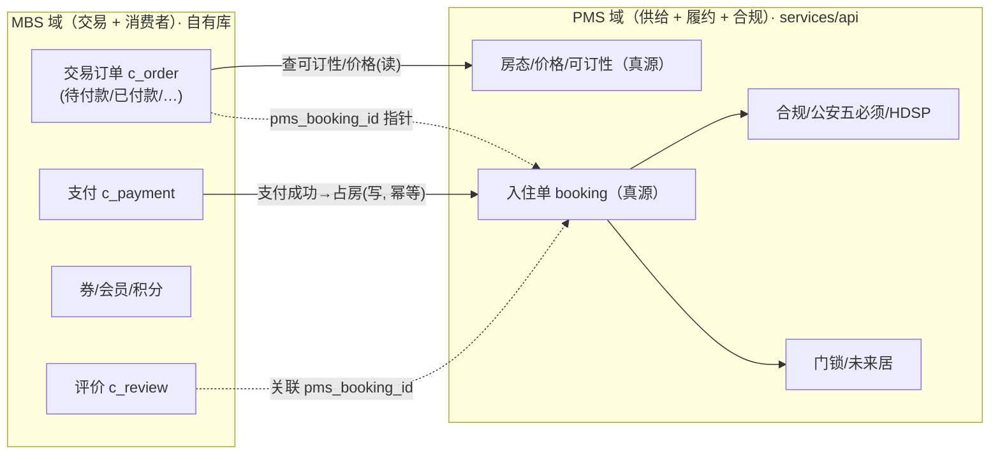

# 03 · 数据归属：PMS vs MBS 边界设计

> 这是整个方案的地基。先把"哪块数据是谁的真源"拍死，功能、架构、表设计都从这里推导。

---

## 1. 判定原则（三条判定线）

给任意一块数据，按顺序问三个问题：

1. **它是不是供给侧的"货架/库存/合规"？**（房源、房型、房间、价格、房态、入住指南配置、门锁、未来居、公安合规规则）
   → 是：**PMS 真源**，C 端只读，绝不在 MBS 落库为真源。
2. **它是不是"入住履约 / 监管上报"必须唯一口径的？**（占房、办入住/退房、房态占用、公安五必须、HDSP 上报、证件照原文）
   → 是：**PMS 真源**，MBS 只持指针 / 便捷副本 / 调用凭证。
3. **其余"由 C 端用户在 C 端产生"的数据**（账号、交易单、支付、券、会员、积分、评价、消息、收藏、足迹、反馈、常用入住人）
   → 全部 **MBS 真源**。

> 直觉版："货"和"合规履约"归 PMS；"人、单、钱、券、评、信"归 MBS。

---

## 2. 关键决策：交易订单 vs 履约订单，必须拆成两张单

这是"C 端能自持数据"与"PMS 仍是履约/合规权威"能同时成立的**唯一干净解法**，也是所有成熟 OTA / 电商的标准做法。

- **交易订单（Trade Order）· MBS 真源**：C 端用户下的"这一单交易"。负责：下单、金额与优惠明细、支付、退款、发票、C 端订单生命周期（待付款/已付款/待入住/已完成/已取消/退款中/已退款）、券核销、评价入口。
- **履约/入住订单（Booking / 入住单）· PMS 真源**：真正占用房态、驱动办入住/退房、公安五必须、门锁下发、未来居推送、经营结算、美团渠道去重的那张单。

**两者的关系**：交易订单支付成功后，MBS 通过一次可靠调用请求 PMS **创建/确认占房**，PMS 返回 `booking_id`；MBS 交易单上保存 `pms_booking_id` 作为指针。此后"入住指南/实名/同住人/自助退房"等履约动作，仍走 PMS（复用现有 `mbs-api → services/api` 能力）。

> 这与"美团订单进 PMS"是**同一套履约模型**：美团是外部交易域，久窝自营 C 端是内部交易域，两者最终都落到 PMS 的 booking 履约域。C 端只是多了一个"我们自己的交易入口"。

### 为什么不把 booking 也搬到 MBS？

因为 booking 与一堆**只在 PMS 存在**的能力强耦合：房态日历占用、批量改价改房态、公安五必须硬闸（`checkin_compliance`）、门锁临时密码、未来居 `checkin/checkout/rmchg`、经营数据/结算、美团渠道去重与反向同步。把它搬走等于把 PMS 半个核心搬走，且会造成**房态双写与超卖**。所以：**库存与占房的事务性动作必须在 PMS 一处完成。**

### 为什么不让交易也留在 PMS（继续 BFF）？

因为 C 端要的是"完整体系"：券/会员/积分/评价/站内信/购物车/发票/裂变——这些是**消费者营销与交易域**，和 PMS（房东经营后台）是**两套完全不同的领域与迭代节奏**。塞进 PMS 会让房东后台背上一堆 C 端营销表，耦合严重、互相拖慢。所以交易域独立在 MBS，是"完整体系"的前提。

---

## 3. 逐域归属判定表

| 领域 | 数据 | 真源 | MBS 是否落库 | 备注 |
|---|---|:---:|:---:|---|
| **供给/货架** | 门店、房型、房间、设施、图集 | PMS | 只读快照(可选) | C 端搜索/详情读 PMS；为性能可建**只读检索快照**（非真源） |
| | 价格、房态、可订性 | PMS | ❌ | 强实时，必须实时查 PMS，防超卖 |
| | 入住指南配置（三层） | PMS | ❌ | 复用现有指南读接口 |
| | 门锁 / 未来居 / 合规规则 | PMS | ❌ | C 端不感知配置，只在履约时读取结果 |
| **账号** | C 端用户、第三方登录(微信/支付宝)、设备/推送 token | **MBS** | ✅ | 现 `mbs-api` 已有用户，增强 |
| **交易** | 交易订单、订单明细、入住人快照 | **MBS** | ✅ | 交易域真源 |
| | 支付流水、退款流水、发票、购物车 | **MBS** | ✅ | 对接微信/支付宝支付 |
| **履约** | 入住单(booking)、办入住/退房、房态占用 | PMS | 指针 | MBS 存 `pms_booking_id` |
| **营销** | 券模板、用户券包、活动、签到、邀请裂变 | **MBS** | ✅ | 券模板"运营配置"也在 MBS（营销归 MBS） |
| | 会员等级、成长值、积分流水 | **MBS** | ✅ | |
| **内容** | 评价、评分、晒图、（房东回复指针） | **MBS** | ✅ | 房东回复由 PMS/运营侧写回 MBS |
| **触达** | 站内信、通知、订阅消息记录、反馈、客服会话 | **MBS** | ✅ | |
| **合规** | 实名核验结果、公安五必须、HDSP、证件照原文 | PMS | ❌ | 监管口径唯一 |
| | 常用入住人 / 我的证件（便捷副本） | **MBS** | ✅(加密/脱敏) | 仅便捷填充，提交时以 PMS 核验为准 |
| **运营** | C 端首页/Banner/专题/内容位配置 | **MBS** | ✅ | C 端运营，归 mbs-admin |

---

## 4. 边界灰区与取舍（评审重点）

### 4.1 实名 / 入住人：便捷副本在 MBS，权威在 PMS
- MBS 存"我的常用入住人"（姓名、证件号加密、手机号加密），仅用于**下单/登记时快速填充**。
- 真正的**实人核验（海鑫 `verify_v3`）、证件照（七牛私有空间）、公安五必须硬闸**仍在 PMS（现有 `identity_verification.py` / `checkin_compliance.py`）。
- 下单或入住登记时：MBS 把用户选中的入住人提交给 PMS 的实名/登记接口，PMS 核验并落 `CheckInGuideIdentitySubmission`（履约/合规真源）。MBS 只保存"核验状态 + 提交指针"。
- 证件号等敏感字段：MBS 侧**加密存储 + 日志脱敏**，与 PMS 现有约束一致。

### 4.2 库存与超卖：占房必须 PMS 事务化
- C 端"提交订单"时先向 PMS 请求**预占（hold）**：PMS 在房态日历上事务性占用（`SELECT ... FOR UPDATE` 或等价乐观锁），返回 hold 令牌 + 有效期（如 15 min）。
- 支付成功后 MBS 请求 PMS **确认占房**→生成正式 booking；超时未支付则 PMS 释放 hold。
- 未接入美团的自建房型才允许 C 端直订；美团房型的房态以美团为权威（现状约束），是否开放需产品决策（见 4.5）。

### 4.3 价格：以 PMS 实时报价为准，MBS 不缓存价格真源
- 下单价格由 PMS 现价 + MBS 券/会员优惠**组合计算**：PMS 出"基础房费/税费"，MBS 出"优惠减免"，最终应付金额 = PMS 报价 − MBS 优惠。
- 为防"看到的价"和"下单的价"不一致：下单时以 hold 返回的 PMS 报价快照为准，MBS 把该快照冻结进交易单明细。

### 4.4 评价与房东回复：评价在 MBS，回复跨域写回
- 评价（评分/文字/晒图）是消费者内容，真源在 MBS，关联 `pms_booking_id`（证明"住过才能评"）。
- 房东/运营对评价的回复由 PMS 房东端或 mbs-admin 触发，通过接口写回 MBS `c_review_reply`。MBS 是评价内容真源。

### 4.5 需产品拍板的开放性问题
- 美团房型是否允许 C 端自营直订？（涉及与美团房态的双写/去重，默认建议：一期只开放**纯自建房型**直订）。
- C 端下单是否走"担保交易/预授权"还是"全额预付"？影响支付与退款状态机。
- 是否引入购物车/多间多晚组合下单（民宿常见是单房型多间/多晚，购物车非必需，一期可弱化）。

---

## 5. 需 PMS 新增 / 开放的接口（供给与履约侧）

> C 端要"完整"，PMS 需要把这些能力以**面向 C 端交易**的接口开放出来（部分已存在，标注"已有"）。全部走 `mbs-api → services/api`，公开接口 HMAC 签名。

| 能力 | 接口（示意） | 状态 | 用途 |
|---|---|:---:|---|
| 房源检索/详情 | `GET /public/listings`, `/public/listings/{id}` | 新增/整合 | C 端发现与详情（可含设施/图集/坐标，美团已同步这些静态信息） |
| 实时报价 | `POST /public/quote`（房型+日期+人数→分日报价） | 新增/整合 | 现有"价格预览/可订查询"面向 C 端封装 |
| 可订性查询 | `GET /public/availability` | 已有(整合) | 现有"某段日期是否可订" |
| **预占 hold** | `POST /public/bookings/hold` | **新增** | 事务占房，返回 hold_token + 过期时间 + 报价快照 |
| **确认占房** | `POST /public/bookings/confirm`（幂等键） | **新增** | 支付成功→生成正式 booking，返回 booking_id |
| **释放 hold** | `POST /public/bookings/release` | **新增** | 取消/超时释放 |
| 取消 booking | `POST /public/bookings/{id}/cancel` | 新增/整合 | 退款联动 |
| 入住指南读取 | `GET /public/guide/{token}` | 已有 | 复用 |
| 实名/登记提交 | `POST /public/guide/identity` | 已有 | 复用（海鑫核验 + 五必须） |
| 同住人管理 | `.../co-occupants` | 已有 | 复用 |
| 自助退房 | `POST /public/checkout` | 已有 | 复用（含美团渠道守卫） |
| 房东联系方式/呼叫房东 | `GET /public/property/contact` | 已有 | 复用（mbs-admin 配置） |

> 幂等与可靠性：`hold/confirm/release/cancel` 全部要求**幂等键**（MBS 生成，PMS 去重），MBS 侧用 outbox 保证"支付成功→确认占房"最终一致（见 `04-架构设计.md` 第 5 节）。

---

## 6. 一页纸边界口径（贴给团队）

> **PMS 管"货和合规履约"**：房源、房态、价格、指南配置、门锁、未来居、占房、办入住退房、公安上报、结算、美团。C 端只读这些，占房/履约调 PMS。
>
> **MBS 管"人、单、钱、券、评、信"**：C 端账号、交易订单、支付退款、优惠券、会员积分、评价、站内信、收藏足迹、反馈、常用入住人（便捷副本）。这些全部是 MBS 自有库的真源。
>
> **接缝只有一处**：支付成功后 MBS 幂等调用 PMS "确认占房"，拿到 `pms_booking_id`，之后履约走 PMS。**除此之外 C 端数据不依赖 PMS 落库。**
