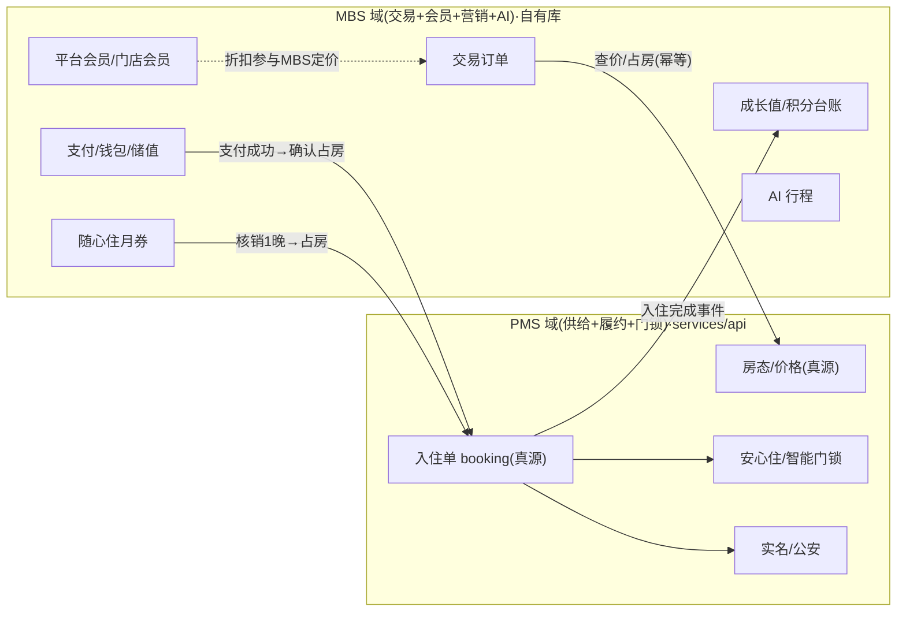

# 03 · 数据归属：PMS vs MBS 边界设计

> 这是整个方案的地基。基于「久窝朋赞会」真实原型，把"哪块数据是谁的真源"拍死。

---

## 1. 判定原则（三条线）

1. **供给侧"货架 / 房态 / 门锁"？**（房源、房型、房间、设施、价格、房态、入住指南配置、安心住/智能门锁）→ **PMS 真源**，C 端只读/调。
2. **"入住履约 / 合规监管"必须唯一口径？**（占房、办入住/退房、房态占用、实名核验、公安五必须、HDSP）→ **PMS 真源**。
3. **其余"C 端用户产生"的数据**（账号、交易单、支付、会员、成长值、积分、储值、随心住、券、礼品卡、收藏、足迹、评价、AI 行程）→ **全部 MBS 真源**。

> 直觉版："货 + 履约 + 门锁"归 PMS；"人、单、钱、券、住晚数换来的会员权益、AI 行程"归 MBS。

---

## 2. 两处关键接缝（MBS 与 PMS 唯一耦合点）

### 接缝一：下单 / 随心住核销 → PMS 占房（交易域 vs 履约域拆两张单）

- **交易订单（Trade Order）· MBS 真源**：C 端下的这一单。负责下单、金额与优惠（平台折 × 门店折 + 券 + 随心住/储值抵扣）、支付、退款、发票、C 端订单生命周期、评价入口。
- **入住/履约单（Booking）· PMS 真源**：真正占房、办入住退房、公安五必须、门锁下发、结算、渠道去重的那张单。
- **对接**：交易订单支付成功（或随心住抵扣确认）后，MBS 幂等调 PMS **确认占房**，PMS 返回 `booking_id`，MBS 交易单存 `pms_booking_id` 指针。此后入住指南/实名/退房走 PMS。
- 这与"美团订单进 PMS"是**同一套履约模型**：外部/自营交易域最终都落到 PMS booking 履约域。

### 接缝二：PMS 履约完成 → MBS 会员成长（"入住事实"vs"会员权益"）

- 客人离店 / 订单完成后，PMS 发**"入住完成"事件**（含 `pms_booking_id`、门店、间夜数、实付额）。
- MBS 消费该事件，累加：**平台成长值**（消费额 + 入住晚数）、**门店入住晚数**（升门店等级）、**平台积分 / 门店积分**、点评奖励。
- 即 **PMS 是"客人到底住了没、住了几晚、花了多少"的真源；MBS 是"这些换来什么会员权益"的真源。** 幂等：以 `pms_booking_id` 为幂等键，防重复加分。

---

## 3. 逐域归属判定表

| 领域 | 数据 | 真源 | MBS 落库 | 备注 |
|---|---|:---:|:---:|---|
| **供给/货架** | 门店(栖舍自营)、房型、房间、设施、图集 | PMS | 只读快照(可选) | C 端搜索/详情读 PMS |
| | 价格、房态、可订性 | PMS | ❌ | 实时查 PMS，防超卖 |
| | 入住指南配置、门锁/安心住 | PMS | ❌ | C 端调用取开锁凭证 |
| **账号** | C 端用户、第三方登录、常用入住人 | MBS | ✅ | |
| **交易** | 交易订单、支付、退款、发票 | MBS | ✅ | 交易域真源 |
| **履约** | 入住单(booking)、办入住/退房、房态占用 | PMS | 指针 | MBS 存 `pms_booking_id` |
| **平台会员** | 等级、成长值、成长值台账 | MBS | ✅ | 成长事实来自 PMS 事件 |
| **门店会员** | 门店等级、累计入住晚数、门店积分 | MBS | ✅ | 晚数来自 PMS 履约事件 |
| **积分** | 平台积分、门店积分（各自独立台账） | MBS | ✅ | |
| **钱包/预付** | 门店储值余额、随心住月券及核销 | MBS | ✅ | **预付资金**，需资金/发票合规 |
| **营销** | 优惠券、礼品卡、活动、签到、邀请 | MBS | ✅ | |
| **内容** | 收藏、足迹、搜索历史、评价 | MBS | ✅ | |
| **AI 行程** | 行程、偏好、问栖会话、POI 内容 | MBS | ✅ | 与 PMS 经营 AI 无关 |
| **合规** | 实名核验、公安五必须、证件照原文 | PMS | ❌ | 监管口径唯一 |

---

## 4. 边界灰区与取舍（评审重点）

### 4.1 会员折扣如何参与定价（定价"组合"在 MBS）
- **PMS 出房价基线**（分日报价 + 房态），MBS 出**折扣与抵扣**：
  `应付 = PMS房价 × 平台会员折 × 门店会员折 − 券 − (随心住抵扣房晚 或 储值扣减)`。
- 演示口径已给出叠加折扣（如平台 9 折 × 门店 8.5 折 → combinedZhe）。落地时**折扣规则、叠加上限、互斥关系（券 vs 随心住 vs 储值）**需产品定义，统一在 MBS 定价服务计算。
- 下单以 PMS `hold` 返回的房价快照为准，MBS 冻结报价+优惠明细进交易单，防"看到价≠下单价"。

### 4.2 随心住 / 储值 = 预付资金（重点合规）
- 随心住是"预付一笔钱换 N 晚房晚权益"，门店储值是"预存余额"。二者都是**预收款**：
  - MBS 需**严谨的资金台账**（钱包 + 流水，只增不改，可对账）。
  - 涉及**发票**（预付时开 or 核销时开）、**退款规则**（未使用晚数是否可退、按原路退）、可能的**资金存管/预付卡合规**——需法务/财务确认。
- **随心住核销**：抵扣 1 晚时，MBS 扣减 `usedDays` 并生成一笔核销流水，同时**必须成功占房**（PMS）。二者要**事务一致**：先 PMS 占房成功再扣券，或扣券失败可回滚/补偿（outbox + 幂等）。
- **门店独立**：随心住/储值/门店积分**各门店独立、不通用**，表结构以 `store_id` 维度隔离。

### 4.3 会员成长的"事实真源"在 PMS
- 成长值/门店晚数/积分**不能只凭 C 端交易单累加**——因为存在美团/自来客等非 C 端下单但真实入住的情况，且"是否真入住、住了几晚"由 PMS 履约决定（可能改期、提前退房）。
- 正确做法：**以 PMS 履约完成事件为准**累加。C 端下单只影响"消费额成长值"的预估，最终以离店结算为准。年度 12/31 结算按规则清零/保留（原型 footnote）。

### 4.4 安心住 / 开锁：门锁在 PMS，MBS 只取凭证
- 装了平台智能门锁（ttlock / jiuchan / 绿盈 luyian）的门店展示"安心住"。**蓝牙 / 碰一下开锁**能力在 PMS 门锁域（现有 mbs 分支 `alipay-tap-unlock`/`mbs-alipay-bluetooth-unlock`/`luyian-bluetooth-unlock` 已有雏形）。
- MBS 在住中卡/房源详情**展示安心住标**，调 PMS 取当前订单的**开锁凭证/蓝牙密钥**，不自持门锁数据。

### 4.5 AI 行程 = MBS 自有 AI 域
- 问栖找房（NL→筛选条件）、AI 行程助手（偏好→多日行程）、今日行程、保存行程，都是 **C 端 AI**，MBS 自建（调 LLM + POI 内容库）。
- 与 PMS 的"经营 AI 助手（给房东）"是**完全不同的域**，不复用其数据。找房结果最终仍查 PMS 房源。POI/城市内容可 MBS 自维护或接三方。

### 4.6 需产品拍板
- 随心住/储值的**退款与发票**规则、资金合规口径。
- 折扣**叠加/互斥**规则（平台折 × 门店折 × 券 × 随心住 × 储值）。
- 门店会员"到店关注即自动加入"的触发点（扫码/定位/下单）。
- 直订是否仅限**自营栖舍门店**（建议是；美团房源不在 C 端直订范围，避免房态双写）。

---

## 5. 需 PMS 新增 / 开放的接口

| 能力 | 接口（示意） | 状态 | 用途 |
|---|---|:---:|---|
| 房源检索/详情 | `GET /public/listings`,`/listings/{id}` | 新增/整合 | 发现与详情 |
| 实时报价 | `POST /public/quote` | 新增/整合 | 分日房价基线 |
| 可订性 | `GET /public/availability` | 已有(整合) | |
| **预占 hold** | `POST /public/bookings/hold` | **新增** | 事务占房，返回 hold_token+报价快照 |
| **确认占房** | `POST /public/bookings/confirm`(幂等) | **新增** | 支付/核销成功→生成 booking |
| **释放 hold** | `POST /public/bookings/release` | **新增** | 取消/超时 |
| 取消 booking | `POST /public/bookings/{id}/cancel` | 新增 | 退款联动 |
| **入住完成事件** | 事件/回调 `booking.completed` | **新增** | 驱动 MBS 会员成长（成长值/晚数/积分） |
| **开锁凭证** | `GET /public/bookings/{id}/lock-credential` | 新增/整合 | 安心住蓝牙/碰一下（现有分支基础上封装） |
| 入住指南/实名/退房/呼叫房东 | 现有 mbs 转发接口 | 已有 | 复用 |

> `hold/confirm/release/cancel` 全部要求**幂等键**；"支付成功/随心住核销 → 确认占房"用 outbox 保证最终一致（见 `04`）。

---

## 6. 一页纸边界口径（贴给团队）

> **PMS 管"货 + 履约 + 门锁"**：房源、房态、价格、入住指南、智能门锁、占房、办入住退房、实名、公安。C 端只读这些，占房/开锁调 PMS。
>
> **MBS 管"人、单、钱、券、会员、AI"**：C 端账号、交易订单、支付退款发票、**平台会员/门店会员/成长值/平台积分/门店积分/门店储值/随心住/优惠券/礼品卡**、收藏足迹评价、AI 行程。全部 MBS 自有库真源。
>
> **两处接缝**：① 支付/随心住核销 → 幂等调 PMS 确认占房拿 `pms_booking_id`；② PMS 入住完成事件 → MBS 累加会员成长。**除此之外 C 端数据不落 PMS。**
