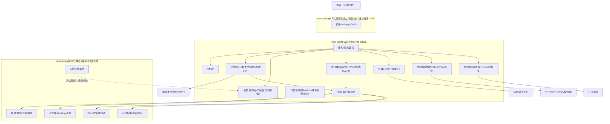
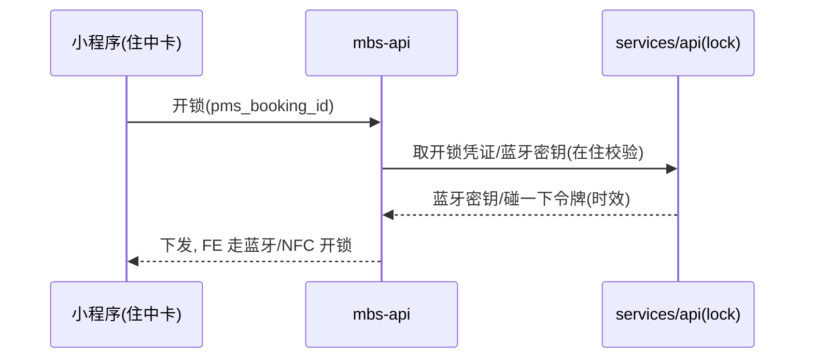

# 04 · 架构设计

> 把 `mbs-api` 从"薄 BFF"升级为**消费者域 + 交易域 + 会员营销域 + AI 域**的业务系统；供给/履约/门锁仍以 PMS 为真源。

---

## 1. 系统上下文



要点：读(房源/报价/指南/开锁凭证)→PMS；写(占房/实名/退房)→PMS(幂等)；**C 端自有域(用户/交易/会员/钱包/AI/内容/触达)全落 MBS 自有库**。

---

## 2. 组件划分（mbs-api 领域分层，NestJS + DDD）

| 域(module) | 职责 | 主要表(见 05) |
|---|---|---|
| `user` | 账号、第三方登录、资料、常用入住人 | `c_user*`,`c_traveler_profile` |
| `catalog`(读) | 房源检索/详情读 PMS + 只读快照 + 收藏/足迹/搜索 | `c_listing_snapshot`,`c_favorite`,`c_browse_history`,`c_search_history` |
| `trade` | 交易订单、支付、退款、发票、**定价服务** | `c_order*`,`c_payment`,`c_refund`,`c_invoice` |
| `member` | 平台会员、门店会员、成长值台账 | `c_member*`,`c_store_member*`,`c_growth_ledger` |
| `wallet` | 门店储值、随心住月券及核销、平台/门店积分、券、礼品卡 | `c_store_wallet*`,`c_flexi_*`,`c_point_ledger*`,`c_coupon*`,`c_giftcard*` |
| `ai` | 问栖会话、行程偏好、行程与结果、POI 内容 | `c_ai_trip*`,`c_ai_pref`,`c_poi` |
| `review` | 评价、评分、晒图、门店回复 | `c_review*` |
| `notify` | 站内信、订阅消息、客服、反馈 | `c_message`,`c_subscribe_msg_log`,`c_feedback` |
| `content`(运营) | 首页运营位/周边礼遇/灵感目的地/随心住广告 | `c_content_*` |
| `platform`(横切) | 幂等、outbox、事件消费、审计、加密 | `c_idempotency_key`,`c_outbox_event`,`c_inbox_event`,`c_audit_log` |
| `pms-client` | hold/confirm/release/quote/lock-credential 幂等封装 + 事件订阅 | — |

---

## 3. 部署形态

- **服务**：`mbs-api` 独立部署，与现有共存逐步迁移；`mbs-admin` 扩展 C 端运营模块。
- **数据库**：**MBS 独立库(MySQL/InnoDB)**，与 PMS 物理隔离——C 端大流量/营销活动与房东后台互不拖累。
- **Redis**：登录态、报价快照短缓存、**库存/券/积分/随心住原子操作**、限流、幂等键、问栖语音会话。
- **对象存储**：七牛（评价晒图公有；证件照走 PMS 私有空间）。
- **检索**：一期 MySQL + `c_listing_snapshot`；量级上来引入 ES。
- **事件**：MBS 消费 PMS "入住完成"事件（MQ/回调 + `c_inbox_event` 去重）；MBS 内部 outbox 驱动"支付成功→占房"、"状态→订阅消息"。
- **资金**：随心住/储值属**预付资金**，钱包台账只增不改、独立对账任务；发票/退款按合规口径。

> 扩展性：交易/会员/钱包/积分为写多热表，PK 用 `BIGINT UNSIGNED AUTO_INCREMENT`；台账类预留按时间分区；未来可按 `user_id` 分片迁 Vitess/PlanetScale。

---

## 4. 关键链路时序

### 4.1 直订：下单 → 占房 → 支付 → 确认（防超卖 + 最终一致）

```mermaid
sequenceDiagram
  participant FE as 小程序
  participant MBS as mbs-api(trade)
  participant PMS as services/api(booking)
  participant PAY as 微信/支付宝
  FE->>MBS: 提交订单(房型/日期/人数/住客/身份证/券)
  MBS->>PMS: hold 预占(幂等键)
  PMS-->>MBS: hold_token + 报价快照 + 过期(15min)
  MBS->>MBS: 定价服务: 平台折×门店折−券−抵扣; 创建交易单(待付款)
  MBS->>PAY: 统一下单
  PAY-->>MBS: 支付回调(异步,幂等)
  MBS->>MBS: c_payment落账; 单→已付款; 写outbox: confirm_booking
  MBS->>PMS: confirm 确认占房(幂等键=order_no)
  PMS-->>MBS: booking_id
  MBS->>MBS: 存 pms_booking_id; 单→待入住
  MBS->>FE: 订阅消息: 预订成功
```
- 超卖防护：占房在 PMS 事务内（行锁/乐观锁 + 库存校验），MBS 不持库存真源。
- 未支付超时：定时任务关单 + `release` 释放 hold（幂等）。

### 4.2 随心住核销（预付房晚抵扣 → 占房，事务一致）

```mermaid
sequenceDiagram
  participant FE as 小程序
  participant MBS as mbs-api(wallet+trade)
  participant PMS as services/api
  FE->>MBS: 用随心住抵扣本单(store, order_no)
  MBS->>MBS: 校验券:门店匹配/生效中/剩余晚数≥所需
  MBS->>PMS: hold→confirm 占房(幂等键=order_no)
  PMS-->>MBS: booking_id
  MBS->>MBS: 扣减 usedDays + 写核销流水(c_flexi_redeem, 幂等)
  Note over MBS: 占房失败则不扣券; 扣券失败可补偿回滚(outbox)
  MBS->>FE: 抵扣成功
```

### 4.3 会员成长（PMS 入住完成 → MBS 加成长值/晚数/积分）

```mermaid
sequenceDiagram
  participant PMS as services/api(booking)
  participant MQ as 事件通道
  participant MBS as mbs-api(member+wallet)
  PMS->>MQ: booking.completed{pms_booking_id,store,nights,paid_amount,user}
  MQ->>MBS: 投递(至少一次)
  MBS->>MBS: c_inbox_event 去重(幂等键=pms_booking_id)
  MBS->>MBS: +成长值(消费额+晚数*100); +平台/门店积分; 门店累计晚数+nights
  MBS->>MBS: 重算平台等级/门店等级; 触发升级通知
```
- 幂等：`pms_booking_id` 唯一，防重复加分；改期/提前退房以 PMS 最终事件为准（可发修正事件冲销）。

### 4.4 安心住开锁（门锁在 PMS，MBS 取凭证）



### 4.5 AI 行程 / 问栖找房

```mermaid
sequenceDiagram
  participant FE as 小程序
  participant MBS as mbs-api(ai)
  participant LLM as LLM/语音
  FE->>MBS: 问栖(语音/文字 NL)
  MBS->>LLM: 语音识别 + 意图解析
  LLM-->>MBS: 城市/人数/关键词/风格
  MBS->>MBS: 存会话; 组装筛选条件
  MBS-->>FE: 跳结果(查PMS房源) / 生成多日行程(POI库)
```

---

## 5. 可靠性与资金安全设计

| 机制 | 用途 | 落地 |
|---|---|---|
| 幂等键 | 支付回调、占房 confirm、随心住核销、券/积分核销、退款 | `c_idempotency_key` + Redis 短锁 |
| Outbox | 支付成功→confirm、核销补偿、状态→订阅消息 | `c_outbox_event` + worker 重试退避 |
| Inbox 去重 | 消费 PMS 入住完成事件 | `c_inbox_event`(幂等键=pms_booking_id) |
| 并发库存 | 防超卖 | PMS 事务占房(真源) |
| **资金台账** | 储值/随心住/积分/成长值 | **只增不改流水 + 余额表 + 每日对账**；改动必留流水 |
| 预付合规 | 随心住/储值 发票/退款/存管 | 独立退款规则 + 发票开具 + 财务对账 |
| 券/积分并发 | 防超发/超扣 | Redis 原子 + DB 唯一约束 + 台账 |
| 会员加分幂等 | 防重复成长 | `pms_booking_id` 唯一 |
| 敏感数据 | 证件号/手机号 | 字段级加密 + 日志脱敏；证件照原文仅 PMS 私有空间 |
| 审计/风控 | 关键操作/领券/签到防刷 | `c_audit_log` + 网关限流 + 风控 |

---

## 6. 关键状态机

**交易订单 `c_order.status`**：`待付款10→已付款20→待入住30(confirm)→已入住40→已完成50`；`10→已取消90`；`20/30→退款中60→已退款70`。
**随心住 `c_flexi_pass.status`**：`生效中active→临期expiring(≤7天)→已过期expired`；晚数：`usedDays/totalDays`；核销写 `c_flexi_redeem`。
**券 `c_coupon.status`**：`未用0→锁定1(下单占用)→已用2→过期3→作废4`。
**平台等级**：由 `c_member.growth` 对照 `memberTiers` 推导；**门店等级**：由门店累计晚数对照 `storeMemberTiers` 推导。

> 履约状态（占房/入住/退房）以 PMS booking 为真源，交易单冗余只读 `booking_status` 供展示。

---

## 7. 迁移策略

1. **不动履约**：入住指南/实名/退房/开锁继续走 PMS，保留 BFF 通道。
2. **新增自有域**：交易/会员/钱包/AI/内容为增量新建，独立库，不影响现有 `mbs-web`。
3. **PMS 增量开放**：优先 `hold/confirm/release/quote` + `booking.completed` 事件 + 开锁凭证。
4. **灰度**：新 C 端与旧 `mbs-web` 并行，按门店/白名单灰度直订与会员能力。
