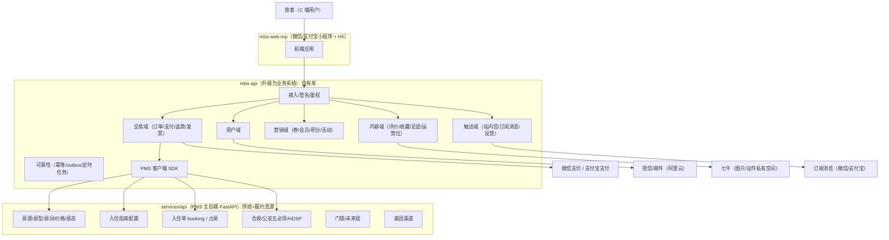
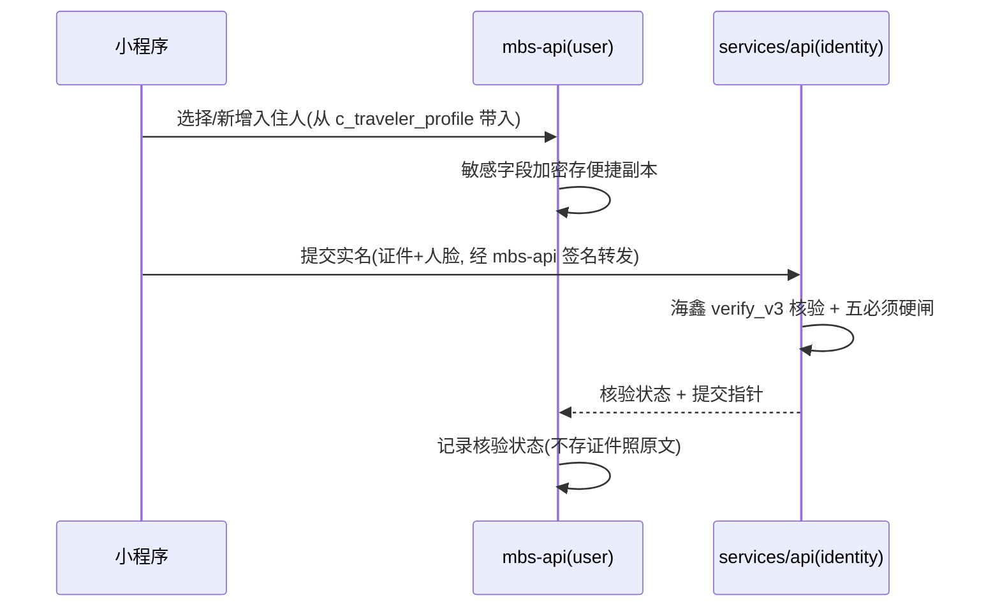

# 04 · 架构设计

> 目标：把 `mbs-api` 从"薄 BFF"升级为**消费者域 + 交易域业务系统**，供给/履约仍以 PMS 为真源。本文给出系统上下文、组件划分、部署形态、关键链路时序与可靠性设计。

---

## 1. 系统上下文（C4-Context）



要点：
- **读**（房源/报价/可订性/指南）→ PMS；**写**（占房/实名/退房）→ PMS（幂等）。
- **C 端自有域（用户/交易/营销/内容/触达）** 全部落 MBS 自有库，是真源。
- 支付、订阅消息、短信、七牛为外部依赖。

---

## 2. 组件划分（mbs-api 内部领域分层）

采用 NestJS 模块化 + DDD 分层，每个域一个 module，域间通过应用服务/领域事件解耦：

| 域（module） | 职责 | 主要表 |
|---|---|---|
| `user` | 账号、第三方登录、资料、设备、常用入住人 | `c_user*`, `c_traveler_profile` |
| `catalog`（读） | 房源检索/详情读 PMS + 只读快照 + 收藏/足迹/搜索 | `c_listing_snapshot`, `c_favorite`, `c_browse_history`, `c_search_history` |
| `trade` | 交易订单、支付、退款、发票、购物车 | `c_order*`, `c_payment`, `c_refund`, `c_invoice` |
| `marketing` | 券模板/券包、会员、积分、活动、签到、邀请 | `c_coupon*`, `c_member*`, `c_promotion`, `c_share_invite` |
| `review` | 评价、评分、晒图、房东回复 | `c_review*` |
| `notify` | 站内信、订阅消息、通知偏好、反馈、客服 | `c_message`, `c_notification_setting`, `c_feedback`, `c_cs_session` |
| `content`（运营） | 首页/Banner/专题/内容位 | `c_content_*` |
| `platform`（横切） | 幂等、outbox、定时任务、审计、加密 | `c_idempotency_key`, `c_outbox_event`, `c_audit_log` |
| `pms-client` | 对 PMS 的 hold/confirm/release/quote/... 幂等封装 | — |

---

## 3. 部署形态

- **服务**：`mbs-api` 独立部署（可与现有共存，逐步迁移）；`mbs-admin`（运营后台）扩展 C 端运营模块。
- **数据库**：**MBS 独立数据库实例/schema**（MySQL/InnoDB），与 PMS 库物理隔离。C 端读写压力（大流量、营销活动）与 PMS 房东后台隔离，互不拖累。
- **缓存**：Redis（登录态、报价快照短缓存、券/库存原子操作、限流、签到、幂等键）。
- **对象存储**：七牛（评价晒图公有空间；证件照仍走 PMS 私有空间）。
- **检索**：一期用 MySQL + 只读快照表满足；数据量/复杂筛选上来后可引入 ES/OpenSearch（`c_listing_snapshot` 作为同步源）。
- **消息/事件**：outbox 表 + 轮询/消息队列（可复用现有 Centrifugo/或 MQ）驱动"支付成功→占房""booking 状态回写"等。

> 扩展性备注：C 端交易/营销表是**写多、增长快**的 OLTP。PK 采用 `BIGINT UNSIGNED AUTO_INCREMENT`；订单/流水类表预留按时间分区能力；若未来量级极大，MySQL 生态可平滑迁 Vitess/PlanetScale 分片（分片键建议 `user_id`）。

---

## 4. 关键链路时序

### 4.1 下单 → 占房 → 支付 → 确认（核心，防超卖 + 最终一致）

```mermaid
sequenceDiagram
  participant FE as 小程序
  participant MBS as mbs-api(trade)
  participant PMS as services/api(booking)
  participant PAY as 微信/支付宝

  FE->>MBS: 提交订单(房型/日期/人数/券/入住人)
  MBS->>PMS: hold 预占(幂等键, 房型/日期/间数)
  PMS-->>MBS: hold_token + 报价快照 + 过期时间(15min)
  MBS->>MBS: 校验券/会员, 计算应付; 冻结报价快照
  MBS->>MBS: 创建交易单 c_order(待付款) + 明细
  MBS->>PAY: 统一下单, 拿预支付参数
  MBS-->>FE: 返回支付参数
  FE->>PAY: 调起支付
  PAY-->>MBS: 支付结果回调(异步, 需幂等)
  MBS->>MBS: 幂等校验; c_payment 落账; 订单→已付款
  MBS->>MBS: 写 outbox: confirm_booking 事件
  MBS-->>PAY: 回调 ACK
  Note over MBS,PMS: outbox worker 异步保证最终一致
  MBS->>PMS: confirm 确认占房(幂等键=order_no)
  PMS-->>MBS: booking_id
  MBS->>MBS: 交易单存 pms_booking_id, 状态→待入住
  MBS->>FE: 订阅消息: 预订成功
```

要点：
- **超卖防护**：占房在 PMS 事务内完成（行锁/乐观锁 + 库存校验），MBS 不持库存真源。
- **未支付超时**：定时任务扫 `待付款` 超时单 → 关单 + `release` 释放 hold（幂等）。
- **支付成功但 confirm 失败**：outbox 重试；PMS confirm 幂等（键=order_no），多次调用只生成一个 booking。极端不可恢复时进人工对账队列 + 自动退款兜底。

### 4.2 取消 / 退款

```mermaid
sequenceDiagram
  participant FE as 小程序
  participant MBS as mbs-api(trade)
  participant PMS as services/api
  participant PAY as 支付渠道

  FE->>MBS: 申请取消/退款(order_no)
  MBS->>MBS: 校验退订政策, 计算可退金额
  MBS->>PMS: 取消/释放 booking(若已 confirm)
  PMS-->>MBS: ok(房态释放)
  MBS->>PAY: 发起退款(幂等)
  PAY-->>MBS: 退款回调
  MBS->>MBS: c_refund 落账, 订单→已退款; 返还券/积分(视规则)
  MBS->>FE: 订阅消息: 退款到账
```

### 4.3 实名登记（便捷副本 + PMS 权威核验）



### 4.4 评价（住过才能评 + 房东回复写回）

```mermaid
sequenceDiagram
  participant FE as 小程序
  participant MBS as mbs-api(review)
  participant ADM as mbs-admin/PMS

  FE->>MBS: 提交评价(order_no→pms_booking_id 校验已完成)
  MBS->>MBS: c_review 落库 + 晒图上七牛; 发积分
  ADM->>MBS: 房东/运营回复(写回 c_review_reply)
  FE->>MBS: 拉取房源评价(含回复)
```

---

## 5. 可靠性设计

| 机制 | 用途 | 落地 |
|---|---|---|
| **幂等键** | 支付回调、占房 confirm、券核销、退款 | `c_idempotency_key`（唯一键去重）+ Redis 短锁 |
| **Outbox** | 支付成功→confirm 占房、状态变更→订阅消息 | `c_outbox_event` + worker 轮询投递 + 指数退避重试 |
| **对账** | 支付/退款与渠道对账、confirm 失败兜底 | 定时对账任务 + 人工队列 |
| **超时释放** | 未支付关单、hold 过期 | 定时任务 + PMS `release` |
| **并发库存** | 防超卖 | PMS 事务占房（真源），MBS 不双写库存 |
| **券/积分并发** | 防超发/超扣 | Redis 原子 + DB 唯一约束 + 台账流水（只增不改） |
| **状态回写** | PMS booking 状态→交易单 | PMS 事件/回调 或 MBS 轮询；以交易单 + booking 指针对齐 |
| **敏感数据** | 证件号/手机号 | 字段级加密 + 日志脱敏；证件照原文只在 PMS 私有空间 |
| **审计** | C 端关键操作留痕 | `c_audit_log` |
| **限流/风控** | 领券/签到/邀请防刷 | 网关限流 + 设备/用户维度风控 |

---

## 6. 状态机（关键枚举）

**交易订单 `c_order.status`**（MBS 真源）：
```
待付款(10) → 已付款(20) → 待入住(30, confirm 成功) → 已入住(40) → 已完成(50)
待付款(10) → 已取消(90, 超时/主动)
已付款(20)/待入住(30) → 退款中(60) → 已退款(70)
```

**支付 `c_payment.status`**：`待支付(0)→成功(1)→失败(2)→已退款(3, 部分/全额)`

**退款 `c_refund.status`**：`待处理(0)→处理中(1)→成功(2)→失败(3)`

**券 `c_coupon.status`**：`未使用(0)→已锁定(1, 下单占用)→已使用(2)→已过期(3)→已作废(4)`

> 履约状态（占房/入住/退房）以 PMS booking 为真源，交易单通过 `pms_booking_id` 映射并冗余一份只读状态用于展示。

---

## 7. 与现状的迁移策略

1. **不动履约**：入住指南/实名/同住人/自助退房继续走 PMS，`mbs-api` 保留 BFF 通道。
2. **新增自有域**：交易/营销/内容/触达为**增量新建**，独立库，不影响现有 `mbs-web`。
3. **PMS 增量开放**：优先推进 `hold/confirm/release/quote/listing` 接口（跨团队关键路径）。
4. **灰度**：新 C 端与旧 `mbs-web` 并行，按渠道/白名单灰度直订能力。
